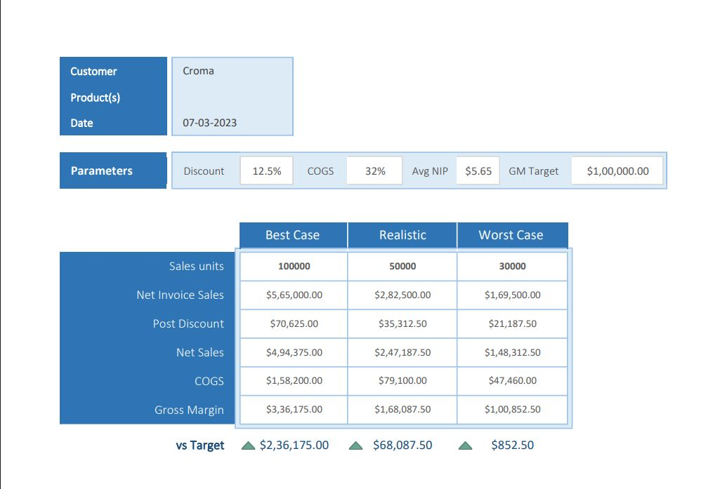

# 📊 Sales & Finance Analytics (Excel) – AtliQ Hardwares Edition

This project is a **Sales & Finance Analytics** case study built in **Microsoft Excel** as part of my Data Analytics learning journey.  
I worked with real business-style datasets to clean, combine, and analyze sales + finance performance, then presented insights using **Pivot Tables, Power Pivot, and interactive visuals** for decision-making.

## 📌 Project Overview
AtliQ Hardwares needed clear visibility into **sales growth, customer performance, market targets, profitability trends, and P&L health**.  
This project focuses on transforming raw data into analysis-ready reporting that answers questions like:

- Which customers drove the highest growth from **2019–2021**?
- Which countries/markets are underperforming vs target?
- How stable is **Gross Margin %** across quarters and regions?
- What does monthly **P&L** reveal about financial health?
- How can scenario planning support forecasting decisions?

## 🎯 What This Project Covers
### Core Business Analysis
- **Net Sales Performance (Customer-level)** with YoY comparison (2019 → 2021)
- **Market vs Target analysis** across 20+ countries
- **Gross Margin % tracking** by quarters and sub-zones
- **P&L statements** by markets and fiscal months (Net Sales, COGS, Gross Margin, GM%)

### Extra Modules
- **Project Priority Matrix** (Quick Wins / Major Projects / Nice to Have / Maybe Later)
- **Scenario-based planning model** (Best / Realistic / Worst case)

### 1) P&L for Markets

### 2) Scenario Planning (Best / Realistic / Worst)

### 3) Project Priority Matrix

### 4) P&L by Fiscal Months

### 5) GM% by Quarters (Sub-Zone)

### 6) Market Performance vs Target

### 7) Customer Net Sales Performance

## 🔧 Workflow (What I Did)
1. **Data Cleaning & Transformation (Power Query)**
   - Removed nulls, fixed errors, standardized formats
   - Prepared consistent tables for modeling and reporting
2. **Data Combination**
   - Used **VLOOKUP / XLOOKUP / HLOOKUP** to merge datasets into a unified view
3. **Pivot Tables + Power Pivot**
   - Built aggregations, calculated fields, and interactive summaries
4. **Sales Performance Analysis**
   - Identified top customers, growth drivers, and YoY performance trends (2019–2021)
5. **Market vs Target Comparison**
   - Compared actual sales vs target across countries to highlight underperformance
6. **Profitability Tracking**
   - Tracked **Gross Margin %** across regions/sub-zones and quarters to spot stability/dips
7. **P&L Statement Reporting**
   - Built structured P&L views (Net Sales, COGS, Gross Margin, GM%) monthly and market-wise
8. **Bonus Add-ons**
   - Created a **Project Priority Matrix** for resource planning
   - Built **scenario-based planning** (best/realistic/worst case) for forecasting

## 📈 Key Insights Enabled
- Customer-level YoY growth tracking (clear winners and growth opportunities)
- Market-level target gaps (which countries need attention)
- Profitability stability checks (where GM% improved or dropped)
- Monthly P&L health signals (trend-based financial monitoring)
- Practical forecasting support using scenario planning

## 🧠 Skills & Tools Used
- **Excel Power Query** (data cleaning, transformation)
- **Pivot Tables** (summaries, interactive analysis)
- **Power Pivot** (model-style calculations, advanced aggregation)
- **Lookup Functions**: VLOOKUP, XLOOKUP, HLOOKUP
- **Financial Reporting** (P&L structure, profitability metrics)
- **Scenario Planning & Forecasting**
- **Data Visualization** (report-style layout for decision making)

└─ README.md
